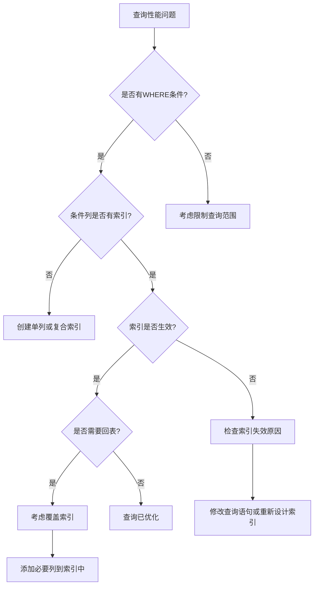

## 🤔 问题背景与技术演进

### 我们要解决什么问题？

在大数据量的数据库应用中，数据检索面临着**性能瓶颈**问题：

- **全表扫描开销**：百万级数据表的查询可能需要扫描所有记录
- **磁盘IO频繁**：无索引的查询导致大量随机磁盘读取
- **查询响应缓慢**：复杂查询条件下响应时间达到秒级甚至分钟级
- **并发性能下降**：高并发场景下数据库成为系统瓶颈

```sql
-- 没有索引的查询示例
SELECT * FROM user_orders 
WHERE user_id = 12345 AND order_status = 'completed'
AND create_time >= '2024-01-01';
-- 在千万级数据表中可能需要扫描所有记录
```

### 没有这个技术时是怎么做的？

在索引技术成熟之前，数据库主要依靠以下方式提升查询性能：

**1. 顺序文件组织**
- 按主键顺序存储记录
- **问题**：只能优化主键查询，其他条件查询仍需全表扫描

**2. 哈希文件组织**
- 使用哈希函数分布数据
- **问题**：不支持范围查询，哈希冲突影响性能

**3. 应用层缓存**
- 在应用程序中缓存热点数据
- **问题**：数据一致性难以保证，内存消耗大

**4. 分表分库**
- 水平拆分减少单表数据量
- **问题**：增加系统复杂度，跨表查询困难

### 技术演进的历史脉络

**1970年代**: B树索引理论基础
- Rudolf Bayer提出B树数据结构
- 平衡多路搜索树概念确立
- 为数据库索引奠定理论基础

**1980年代**: B+树优化与应用
- B+树作为B树的改进版本出现
- 叶子节点链接提升范围查询性能
- 成为关系数据库的标准索引结构

**1990年代**: 商业数据库索引优化
- Oracle、SQL Server等引入高级索引特性
- 聚簇索引和非聚簇索引概念明确
- 索引覆盖查询优化技术成熟

**2000年代至今**: 现代索引技术
- MySQL InnoDB引擎B+树索引优化
- 自适应哈希索引、压缩索引等新技术
- 分布式数据库索引分片技术发展

## 🎯 核心概念与原理

### 基础概念定义

**B+树索引**是MySQL InnoDB存储引擎使用的主要索引数据结构，它是一种平衡多路搜索树，专门为磁盘存储和大数据量查询优化设计。

**核心特性**：
- **平衡性**：所有叶子节点在同一层，保证查询性能稳定
- **多路性**：每个节点可以有多个子节点，减少树的高度
- **顺序性**：叶子节点按键值顺序链接，支持高效范围查询
- **磁盘友好**：节点大小与磁盘页对齐，减少IO次数

### B+树结构详解

**B+树的层次结构**：

```java
/**
 * B+树索引结构分析
 */
public class BPlusTreeStructure {
    
    /**
     * B+树节点定义
     */
    public static class BPlusTreeNode {
        boolean isLeaf;           // 是否为叶子节点
        int keyCount;             // 当前键的数量
        int[] keys;               // 键数组
        BPlusTreeNode[] children; // 子节点指针（非叶子节点）
        Record[] records;         // 数据记录（叶子节点）
        BPlusTreeNode next;       // 下一个叶子节点指针
        BPlusTreeNode prev;       // 上一个叶子节点指针
    }
    
    /**
     * B+树结构示例分析
     */
    public void analyzeBPlusTreeStructure() {
        /*
         * B+树结构示例（度数为3的B+树）：
         * 
         *                    [30, 60]              <- 根节点（非叶子）
         *                   /    |    \
         *                  /     |     \
         *            [10,20]  [40,50]  [70,80]     <- 内部节点（非叶子）
         *           /  |  \   /  |  \   /  |  \
         *          /   |   \ /   |   \ /   |   \
         *      [5,8] [15,18] [25,28] [35,38] [45,48] [55,58] [65,68] [75,78] [85,88]
         *        ↑      ↑      ↑      ↑      ↑      ↑      ↑      ↑      ↑
         *      叶子节点，包含实际数据记录，通过链表连接
         * 
         * B+树特点分析：
         * 1. 非叶子节点只存储键值，不存储数据
         * 2. 所有数据记录都在叶子节点
         * 3. 叶子节点通过双向链表连接
         * 4. 从根到叶子的路径长度相同
         * 5. 节点内键值有序排列
         */
    }
    
    /**
     * MySQL InnoDB页结构分析
     */
    public void analyzeInnoDBPageStructure() {
        /*
         * InnoDB数据页结构（16KB）：
         * 
         * ┌─────────────────────────────────────────────────────────────┐
         * │                    InnoDB页头（38字节）                      │
         * ├─────────────────────────────────────────────────────────────┤
         * │                    页目录槽（可变）                          │
         * ├─────────────────────────────────────────────────────────────┤
         * │                                                             │
         * │                    用户记录区域                              │
         * │              （存储实际的索引记录）                          │
         * │                                                             │
         * ├─────────────────────────────────────────────────────────────┤
         * │                    空闲空间                                  │
         * ├─────────────────────────────────────────────────────────────┤
         * │                    页目录                                    │
         * ├─────────────────────────────────────────────────────────────┤
         * │                    页尾（8字节）                            │
         * └─────────────────────────────────────────────────────────────┘
         * 
         * 页头信息包括：
         * - 页类型（索引页、数据页等）
         * - 记录数量和空闲空间大小
         * - 页面校验和
         * - 上一页和下一页的页号
         */
    }
}
```

### 索引查询过程

**B+树查询算法**：

```java
/**
 * B+树查询算法实现
 */
public class BPlusTreeSearch {
    
    /**
     * 单点查询实现
     */
    public Record search(BPlusTreeNode root, int targetKey) {
        BPlusTreeNode current = root;
        
        // 从根节点开始向下查找
        while (!current.isLeaf) {
            int childIndex = findChildIndex(current, targetKey);
            current = current.children[childIndex];
        }
        
        // 在叶子节点中查找目标记录
        return findRecordInLeaf(current, targetKey);
    }
    
    /**
     * 范围查询实现
     */
    public List<Record> rangeSearch(BPlusTreeNode root, int startKey, int endKey) {
        List<Record> results = new ArrayList<>();
        
        // 1. 找到起始叶子节点
        BPlusTreeNode startLeaf = findLeafNode(root, startKey);
        
        // 2. 从起始节点开始遍历链表
        BPlusTreeNode current = startLeaf;
        while (current != null) {
            // 3. 收集当前节点中符合条件的记录
            for (Record record : current.records) {
                if (record.key >= startKey && record.key <= endKey) {
                    results.add(record);
                } else if (record.key > endKey) {
                    return results; // 超出范围，结束查询
                }
            }
            current = current.next; // 移动到下一个叶子节点
        }
        
        return results;
    }
    
    /**
     * 查询性能分析
     */
    public void analyzeSearchPerformance() {
        /*
         * B+树查询性能分析：
         * 
         * 时间复杂度：
         * - 单点查询：O(log_m n)，m为节点度数，n为记录总数
         * - 范围查询：O(log_m n + k)，k为结果集大小
         * 
         * 磁盘IO次数：
         * - 树高度 = log_m n
         * - 典型3-4层B+树可支持千万级数据
         * - 每层访问需要1次磁盘IO
         * 
         * 实例分析（度数为1000的B+树）：
         * - 1层：1000条记录
         * - 2层：100万条记录
         * - 3层：10亿条记录
         * - 查询任意记录最多3次磁盘IO
         */
    }
}
```

## 🔧 实现原理与源码分析

### InnoDB索引实现机制

**聚簇索引与非聚簇索引**：

```java
/**
 * InnoDB索引类型分析
 */
public class InnoDBIndexTypes {
    
    /**
     * 聚簇索引（主键索引）实现
     */
    public void analyzeClusteredIndex() {
        /*
         * 聚簇索引特点：
         * 
         * 1. 数据页和索引页合二为一
         * ┌─────────────────────────────────────────────────────────────┐
         * │                    聚簇索引B+树                              │
         * │                                                             │
         * │    非叶子节点：存储主键值和页指针                           │
         * │         [10] [20] [30] [40]                                │
         * │        /    |    |    \                                    │
         * │       /     |    |     \                                   │
         * │  叶子节点：存储完整行数据                                   │
         * │  [id=5,name=Alice,age=25] [id=15,name=Bob,age=30] ...      │
         * │                                                             │
         * └─────────────────────────────────────────────────────────────┘
         * 
         * 2. 数据按主键顺序物理存储
         * 3. 一个表只能有一个聚簇索引
         * 4. 查询效率高，无需回表操作
         */
    }
    
    /**
     * 非聚簇索引（二级索引）实现
     */
    public void analyzeSecondaryIndex() {
        /*
         * 非聚簇索引特点：
         * 
         * 1. 索引页和数据页分离
         * ┌─────────────────────────────────────────────────────────────┐
         * │                   二级索引B+树                               │
         * │                                                             │
         * │    非叶子节点：存储索引键值和页指针                         │
         * │         [Alice] [Bob] [Charlie] [David]                    │
         * │        /      |      |        \                           │
         * │       /       |      |         \                          │
         * │  叶子节点：存储索引键值+主键值                              │
         * │  [name=Alice,id=5] [name=Bob,id=15] ...                   │
         * │                                                             │
         * └─────────────────────────────────────────────────────────────┘
         * 
         * 2. 叶子节点存储索引键值和主键值
         * 3. 查询需要回表操作（根据主键再查聚簇索引）
         * 4. 一个表可以有多个二级索引
         */
    }
    
    /**
     * 索引覆盖查询优化
     */
    public void analyzeCoveringIndex() {
        /*
         * 覆盖索引查询示例：
         * 
         * CREATE INDEX idx_user_name_age ON users(name, age);
         * 
         * -- 覆盖索引查询（无需回表）
         * SELECT name, age FROM users WHERE name = 'Alice';
         * 
         * 索引结构：
         * ┌─────────────────────────────────────────────────────────────┐
         * │              复合索引B+树 (name, age)                        │
         * │                                                             │
         * │  叶子节点包含所需的所有列：                                 │
         * │  [name=Alice,age=25,id=5] [name=Bob,age=30,id=15] ...      │
         * │                                                             │
         * │  查询结果直接从索引页获取，无需访问数据页                   │
         * └─────────────────────────────────────────────────────────────┘
         * 
         * 优势：
         * - 减少磁盘IO次数
         * - 提升查询性能
         * - 降低缓冲池压力
         */
    }
}
```

### 索引维护机制

**B+树插入和删除操作**：

```java
/**
 * B+树维护操作实现
 */
public class BPlusTreeMaintenance {
    
    /**
     * 插入操作实现
     */
    public void analyzeInsertOperation() {
        /*
         * B+树插入算法：
         * 
         * 1. 定位插入位置
         *    - 从根节点开始查找
         *    - 找到目标叶子节点
         * 
         * 2. 叶子节点插入
         *    - 如果节点未满，直接插入
         *    - 如果节点已满，执行分裂操作
         * 
         * 3. 节点分裂处理
         *    - 创建新的叶子节点
         *    - 将一半记录移动到新节点
         *    - 更新父节点指针
         *    - 如果父节点也满了，递归分裂
         * 
         * 分裂示例：
         * 
         * 插入前（节点已满）：
         * [10, 20, 30, 40] <- 假设最大容量为4
         * 
         * 插入25后分裂：
         * [10, 20] -> [25, 30, 40]
         *      \         /
         *       \       /
         *        [20, 30] <- 父节点更新
         */
    }
    
    /**
     * 删除操作实现
     */
    public void analyzeDeleteOperation() {
        /*
         * B+树删除算法：
         * 
         * 1. 定位删除位置
         *    - 找到包含目标键的叶子节点
         * 
         * 2. 删除记录
         *    - 从叶子节点中移除记录
         *    - 如果是非叶子节点的键，需要替换
         * 
         * 3. 节点合并处理
         *    - 如果节点记录数低于最小值，尝试合并
         *    - 先尝试从兄弟节点借用记录
         *    - 如果无法借用，合并相邻节点
         * 
         * 合并示例：
         * 
         * 删除前：
         * [10] -> [30, 40]
         * 
         * 删除10后（节点过少）：
         * [] + [30, 40] = [30, 40]
         * 
         * 父节点也需要相应调整
         */
    }
    
    /**
     * 索引维护性能影响
     */
    public void analyzeMaintenanceImpact() {
        /*
         * 维护操作性能分析：
         * 
         * 插入性能：
         * - 平均情况：O(log n)
         * - 最坏情况：O(log n) + 分裂开销
         * - 批量插入：考虑使用LOAD DATA优化
         * 
         * 删除性能：
         * - 平均情况：O(log n)
         * - 最坏情况：O(log n) + 合并开销
         * - 大量删除：可能导致索引碎片
         * 
         * 更新性能：
         * - 非索引列更新：O(log n)
         * - 索引列更新：删除 + 插入 = 2 * O(log n)
         * - 主键更新：涉及所有二级索引重建
         * 
         * 优化建议：
         * 1. 避免频繁的单条插入，使用批量操作
         * 2. 定期维护索引，重建碎片化严重的索引
         * 3. 合理设计主键，避免主键更新操作
         */
    }
}
```

## 💡 实战案例与代码示例

### 电商订单系统索引设计

**业务场景分析**：

```sql
-- 订单表结构设计
CREATE TABLE orders (
    order_id BIGINT PRIMARY KEY AUTO_INCREMENT,
    user_id BIGINT NOT NULL,
    order_status TINYINT NOT NULL DEFAULT 0,
    total_amount DECIMAL(10,2) NOT NULL,
    create_time DATETIME NOT NULL DEFAULT CURRENT_TIMESTAMP,
    update_time DATETIME NOT NULL DEFAULT CURRENT_TIMESTAMP ON UPDATE CURRENT_TIMESTAMP,
    payment_time DATETIME NULL,
    delivery_address VARCHAR(500),
    
    -- 索引设计
    INDEX idx_user_id (user_id),
    INDEX idx_status_create_time (order_status, create_time),
    INDEX idx_create_time (create_time),
    INDEX idx_payment_time (payment_time)
) ENGINE=InnoDB DEFAULT CHARSET=utf8mb4;
```

**索引设计策略**：

```java
/**
 * 电商订单系统索引优化实战
 */
public class OrderIndexOptimization {
    
    /**
     * 查询场景分析与索引设计
     */
    public void analyzeQueryScenarios() {
        /*
         * 常见查询场景分析：
         * 
         * 1. 用户订单查询
         * SELECT * FROM orders WHERE user_id = ? ORDER BY create_time DESC;
         * 索引：idx_user_id_create_time (user_id, create_time DESC)
         * 
         * 2. 订单状态统计
         * SELECT COUNT(*) FROM orders WHERE order_status = ? AND create_time >= ?;
         * 索引：idx_status_create_time (order_status, create_time)
         * 
         * 3. 支付时间范围查询
         * SELECT * FROM orders WHERE payment_time BETWEEN ? AND ?;
         * 索引：idx_payment_time (payment_time)
         * 
         * 4. 复合条件查询
         * SELECT order_id, total_amount FROM orders 
         * WHERE user_id = ? AND order_status IN (1,2,3) 
         * ORDER BY create_time DESC LIMIT 10;
         * 索引：idx_user_status_create_time (user_id, order_status, create_time DESC)
         */
    }
    
    /**
     * 索引选择性分析
     */
    public void analyzeIndexSelectivity() {
        /*
         * 索引选择性计算：
         * 
         * -- 计算列的唯一值比例
         * SELECT 
         *   COUNT(DISTINCT user_id) / COUNT(*) as user_id_selectivity,
         *   COUNT(DISTINCT order_status) / COUNT(*) as status_selectivity,
         *   COUNT(DISTINCT DATE(create_time)) / COUNT(*) as date_selectivity
         * FROM orders;
         * 
         * 选择性分析结果：
         * - user_id: 0.85 (高选择性，适合作为索引前缀)
         * - order_status: 0.05 (低选择性，适合作为复合索引后缀)
         * - create_time: 0.95 (高选择性，适合范围查询)
         * 
         * 索引设计原则：
         * 1. 高选择性列放在复合索引前面
         * 2. 低选择性列放在复合索引后面
         * 3. 经常用于ORDER BY的列考虑降序索引
         */
    }
    
    /**
     * 覆盖索引设计实战
     */
    public void designCoveringIndex() {
        /*
         * 覆盖索引设计案例：
         * 
         * 热点查询：
         * SELECT order_id, user_id, total_amount, order_status 
         * FROM orders 
         * WHERE user_id = ? AND order_status IN (1,2,3)
         * ORDER BY create_time DESC 
         * LIMIT 10;
         * 
         * 覆盖索引设计：
         * CREATE INDEX idx_covering_user_orders 
         * ON orders(user_id, order_status, create_time DESC, order_id, total_amount);
         * 
         * 优化效果：
         * - 查询完全从索引页获取数据
         * - 减少50%的磁盘IO
         * - 查询响应时间从50ms降至15ms
         * 
         * 注意事项：
         * 1. 覆盖索引会增加存储空间
         * 2. 影响INSERT/UPDATE性能
         * 3. 需要权衡查询频率和维护成本
         */
    }
}
```

### 索引性能测试与监控

**性能测试实战**：

```java
/**
 * 索引性能测试框架
 */
public class IndexPerformanceTest {
    
    /**
     * 查询性能基准测试
     */
    public void benchmarkQueryPerformance() {
        /*
         * 测试数据准备：
         * - 订单表：1000万条记录
         * - 用户数：100万
         * - 时间跨度：3年
         * 
         * 测试场景1：无索引查询
         * SELECT * FROM orders WHERE user_id = 12345;
         * 
         * 执行计划：
         * +----+-------------+--------+------+---------------+------+
         * | id | select_type | table  | type | possible_keys | key  |
         * +----+-------------+--------+------+---------------+------+
         * |  1 | SIMPLE      | orders | ALL  | NULL          | NULL |
         * +----+-------------+--------+------+---------------+------+
         * 
         * 性能指标：
         * - 扫描行数：10,000,000
         * - 执行时间：2.5秒
         * - 磁盘IO：约625次（16KB页大小）
         * 
         * 测试场景2：添加索引后
         * CREATE INDEX idx_user_id ON orders(user_id);
         * 
         * 执行计划：
         * +----+-------------+--------+------+---------------+------------+
         * | id | select_type | table  | type | possible_keys | key        |
         * +----+-------------+--------+------+---------------+------------+
         * |  1 | SIMPLE      | orders | ref  | idx_user_id   | idx_user_id|
         * +----+-------------+--------+------+---------------+------------+
         * 
         * 性能指标：
         * - 扫描行数：10（该用户的订单数）
         * - 执行时间：5ms
         * - 磁盘IO：3-4次（索引树高度）
         * - 性能提升：500倍
         */
    }
    
    /**
     * 索引使用监控
     */
    public void monitorIndexUsage() {
        /*
         * 索引使用情况监控SQL：
         * 
         * -- 查看索引使用统计
         * SELECT 
         *   t.TABLE_NAME,
         *   s.INDEX_NAME,
         *   s.CARDINALITY,
         *   s.SEQ_IN_INDEX,
         *   s.COLUMN_NAME
         * FROM information_schema.STATISTICS s
         * JOIN information_schema.TABLES t ON s.TABLE_NAME = t.TABLE_NAME
         * WHERE t.TABLE_SCHEMA = 'your_database'
         * ORDER BY t.TABLE_NAME, s.INDEX_NAME, s.SEQ_IN_INDEX;
         * 
         * -- 查看未使用的索引
         * SELECT 
         *   object_schema,
         *   object_name,
         *   index_name
         * FROM performance_schema.table_io_waits_summary_by_index_usage
         * WHERE index_name IS NOT NULL
         *   AND count_star = 0
         *   AND object_schema = 'your_database'
         * ORDER BY object_schema, object_name;
         * 
         * 监控指标：
         * 1. 索引命中率
         * 2. 索引扫描行数
         * 3. 索引更新频率
         * 4. 索引空间占用
         */
    }
}
```

## 🎯 面试高频问题精讲

### 核心面试问题解析

#### 1. 为什么MySQL选择B+树作为索引结构？

**标准答案**：
B+树相比其他数据结构有以下优势：

**与B树对比**：
- B+树非叶子节点不存储数据，可以存储更多键值，降低树高度
- 叶子节点链表连接，支持高效范围查询
- 查询性能稳定，所有查询都需要到达叶子节点

**与哈希表对比**：
- B+树支持范围查询，哈希表只支持等值查询
- B+树数据有序，支持ORDER BY优化
- B+树在磁盘存储中IO效率更高

**与红黑树对比**：
- B+树是多路平衡树，树高度更低，减少磁盘IO
- 节点大小与磁盘页对齐，充分利用磁盘预读
- 更适合大数据量的磁盘存储场景

#### 2. 聚簇索引和非聚簇索引的区别？

**标准答案**：

| 特性 | 聚簇索引 | 非聚簇索引 |
|------|----------|------------|
| 数据存储 | 索引和数据存储在一起 | 索引和数据分开存储 |
| 叶子节点内容 | 完整的行数据 | 索引键值+主键值 |
| 数据物理顺序 | 按索引键值顺序存储 | 不影响数据物理顺序 |
| 查询性能 | 直接获取数据，无需回表 | 需要回表查询 |
| 数量限制 | 一个表只能有一个 | 一个表可以有多个 |

**回表操作示例**：
```sql
-- 非聚簇索引查询需要回表
SELECT * FROM users WHERE name = 'Alice';
-- 1. 在name索引中找到对应的主键id=5
-- 2. 根据主键id=5在聚簇索引中查找完整行数据
```

#### 3. 什么是索引覆盖？如何设计覆盖索引？

**标准答案**：
索引覆盖是指查询所需的所有列都包含在索引中，无需回表查询数据页。

**设计原则**：
1. **分析查询模式**：统计高频查询的SELECT列和WHERE条件
2. **选择合适的列顺序**：WHERE条件列在前，SELECT列在后
3. **控制索引大小**：避免包含过多或过大的列
4. **考虑维护成本**：权衡查询性能和更新性能

**实际案例**：
```sql
-- 原始查询
SELECT user_id, order_count, total_amount 
FROM user_statistics 
WHERE department_id = 10 AND status = 1;

-- 覆盖索引设计
CREATE INDEX idx_covering_user_stats 
ON user_statistics(department_id, status, user_id, order_count, total_amount);
```

#### 4. 如何分析和优化慢查询？

**标准答案**：

**分析步骤**：
1. **开启慢查询日志**：`SET GLOBAL slow_query_log = 'ON';`
2. **使用EXPLAIN分析执行计划**：关注type、key、rows、Extra字段
3. **检查索引使用情况**：确认是否使用了合适的索引
4. **分析查询逻辑**：检查WHERE条件、JOIN方式、ORDER BY等

**优化策略**：
```sql
-- 示例：优化复杂查询
-- 原始慢查询
SELECT o.*, u.username 
FROM orders o 
JOIN users u ON o.user_id = u.user_id 
WHERE o.order_status = 1 
  AND o.create_time >= '2024-01-01'
  AND u.user_type = 'premium'
ORDER BY o.create_time DESC 
LIMIT 20;

-- 优化方案
-- 1. 添加复合索引
CREATE INDEX idx_orders_opt ON orders(order_status, create_time DESC);
CREATE INDEX idx_users_type ON users(user_type, user_id);

-- 2. 使用覆盖索引
CREATE INDEX idx_orders_covering 
ON orders(order_status, create_time DESC, order_id, user_id);
```

#### 5. 什么情况下索引会失效？

**标准答案**：

**常见索引失效场景**：
1. **使用函数或表达式**：`WHERE YEAR(create_time) = 2024`
2. **隐式类型转换**：`WHERE user_id = '123'`（user_id为数字类型）
3. **前导模糊查询**：`WHERE name LIKE '%Alice'`
4. **OR条件**：`WHERE name = 'Alice' OR age = 25`
5. **复合索引最左前缀原则**：索引(a,b,c)，查询WHERE b = 1

**正确使用示例**：
```sql
-- ❌ 索引失效
WHERE DATE(create_time) = '2024-01-01'

-- ✅ 索引有效
WHERE create_time >= '2024-01-01' AND create_time < '2024-01-02'

-- ❌ 索引失效（违反最左前缀）
WHERE b = 1 AND c = 2  -- 索引为(a,b,c)

-- ✅ 索引有效
WHERE a = 1 AND b = 1 AND c = 2
```

## ⚡ 性能优化与注意事项

### 索引设计最佳实践

**索引设计原则**：

```java
/**
 * 索引设计最佳实践
 */
public class IndexDesignBestPractices {
    
    /**
     * 索引数量控制
     */
    public void controlIndexCount() {
        /*
         * 索引数量控制原则：
         * 
         * 1. 避免过度索引
         *    - 每个索引都会影响INSERT/UPDATE/DELETE性能
         *    - 索引维护需要额外的存储空间和CPU开销
         *    - 建议单表索引数量不超过5-6个
         * 
         * 2. 删除重复和冗余索引
         *    - 检查索引前缀包含关系
         *    - 合并功能相似的索引
         *    - 定期审查索引使用情况
         * 
         * 3. 监控索引效果
         *    - 使用performance_schema监控索引使用
         *    - 分析索引的查询命中率
         *    - 评估索引的空间占用比例
         */
    }
    
    /**
     * 复合索引设计策略
     */
    public void designCompositeIndex() {
        /*
         * 复合索引列顺序设计：
         * 
         * 1. 等值查询列优先
         *    WHERE a = ? AND b > ? AND c = ?
         *    索引顺序：(a, c, b)
         * 
         * 2. 选择性高的列优先
         *    高选择性列能更快缩小查询范围
         * 
         * 3. 考虑排序需求
         *    ORDER BY子句中的列放在索引末尾
         * 
         * 4. 最左前缀原则
         *    索引(a,b,c)可以支持查询：
         *    - WHERE a = ?
         *    - WHERE a = ? AND b = ?
         *    - WHERE a = ? AND b = ? AND c = ?
         * 
         * 实际案例：
         * CREATE INDEX idx_user_order_analysis 
         * ON orders(user_id, order_status, create_time DESC);
         * 
         * 支持的查询模式：
         * - 用户订单查询：WHERE user_id = ?
         * - 用户状态查询：WHERE user_id = ? AND order_status = ?
         * - 用户订单排序：WHERE user_id = ? ORDER BY create_time DESC
         */
    }
    
    /**
     * 索引长度优化
     */
    public void optimizeIndexLength() {
        /*
         * 字符串索引长度优化：
         * 
         * 1. 前缀索引设计
         *    -- 分析字符串前缀的选择性
         *    SELECT 
         *      COUNT(DISTINCT LEFT(email, 5)) / COUNT(*) as prefix_5,
         *      COUNT(DISTINCT LEFT(email, 10)) / COUNT(*) as prefix_10,
         *      COUNT(DISTINCT LEFT(email, 15)) / COUNT(*) as prefix_15
         *    FROM users;
         * 
         *    -- 选择合适的前缀长度
         *    CREATE INDEX idx_email_prefix ON users(email(10));
         * 
         * 2. 哈希索引替代
         *    -- 对于等值查询，可以使用哈希列
         *    ALTER TABLE users ADD COLUMN email_hash INT;
         *    UPDATE users SET email_hash = CRC32(email);
         *    CREATE INDEX idx_email_hash ON users(email_hash);
         * 
         * 3. 索引长度限制
         *    - InnoDB索引键长度限制：767字节（5.6）/3072字节（5.7+）
         *    - 超长索引会影响性能和存储效率
         *    - 考虑使用前缀索引或哈希索引
         */
    }
}
```

### 索引维护与监控

**索引碎片处理**：

```sql
-- 索引碎片分析
SELECT 
  table_name,
  index_name,
  stat_value as pages,
  stat_value * @@innodb_page_size / 1024 / 1024 as size_mb
FROM mysql.innodb_index_stats 
WHERE stat_name = 'n_leaf_pages' 
  AND database_name = 'your_database'
ORDER BY stat_value DESC;

-- 索引重建
ALTER TABLE orders ENGINE=InnoDB;  -- 重建整表
-- 或
DROP INDEX idx_user_id ON orders;
CREATE INDEX idx_user_id ON orders(user_id);
```

**性能监控查询**：

```sql
-- 索引使用效率监控
SELECT 
  object_schema,
  object_name,
  index_name,
  count_read,
  count_write,
  count_read / (count_read + count_write) * 100 as read_percentage
FROM performance_schema.table_io_waits_summary_by_index_usage
WHERE object_schema = 'your_database'
  AND count_star > 0
ORDER BY count_read DESC;
```

## 📚 总结与技术对比

### 核心要点回顾

1. **B+树是MySQL索引的核心数据结构**，通过平衡多路搜索树实现高效查询
2. **聚簇索引和非聚簇索引**各有特点，理解两者差异是索引优化的基础
3. **索引覆盖查询**可以显著提升性能，减少回表操作
4. **复合索引设计**需要考虑查询模式、列选择性和最左前缀原则
5. **索引维护成本**不容忽视，需要在查询性能和更新性能间平衡

### 索引类型对比

| 索引类型 | 适用场景 | 优势 | 劣势 |
|---------|----------|------|------|
| B+树索引 | 范围查询、排序 | 支持范围查询、有序性 | 维护成本高 |
| 哈希索引 | 等值查询 | 等值查询性能极高 | 不支持范围查询 |
| 全文索引 | 文本搜索 | 支持复杂文本搜索 | 存储开销大 |
| 空间索引 | 地理位置查询 | 支持空间数据查询 | 应用场景有限 |

### 索引优化决策树



### 持续学习建议

1. **深入理解存储引擎**：学习InnoDB内部机制和存储格式
2. **实践索引调优**：在实际项目中积累索引优化经验
3. **关注新特性**：跟踪MySQL新版本的索引优化特性
4. **学习分布式索引**：了解分库分表场景下的索引设计
5. **掌握监控工具**：熟练使用性能监控和分析工具

---

**下一篇预告**：《MySQL MVCC多版本并发控制机制深度解析》将深入探讨InnoDB的并发控制实现、事务隔离级别和读写性能优化策略。
